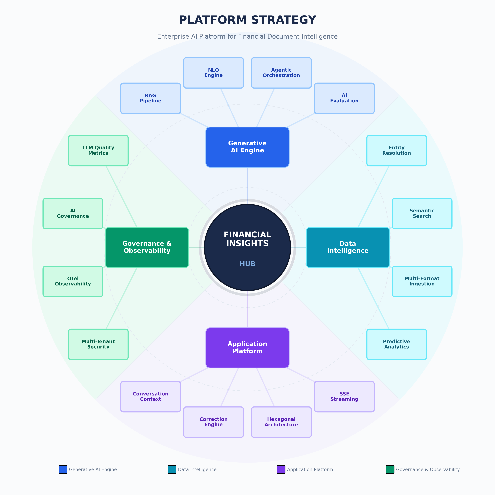

# Financial Insights Hub — AI Document Intelligence Platform

[](https://python.org)
[](https://fastapi.tiangolo.com)
[](https://react.dev)
[](https://cloud.google.com/vertex-ai)
[](https://github.com/pgvector/pgvector)
[](https://langfuse.com)
[](https://opentelemetry.io)

> An AI platform for financial document analysis — built with the architecture patterns, evaluation discipline, and operational rigor you'd expect in regulated financial services. Every decision is deliberate: where the system should be deterministic, where it should be probabilistic, and why.

**Keywords:** AI document intelligence, LLM extraction pipeline, financial document processing, context engineering, RAG pipeline, natural language to SQL, NLQ engine, Vertex AI Gemini, document classification, OCR PDF extraction, clean architecture Python, spec-driven development, LLM observability, AI governance compliance, golden dataset evaluation, LLM-as-a-Judge, prompt engineering patterns, deterministic vs probabilistic AI, agentic orchestration, ReAct pattern, entity resolution, pgvector embeddings, OpenTelemetry GenAI, Langfuse self-hosted, multi-tenant security, FastAPI production architecture

---

## Table of Contents

- [What This Repository Contains](#what-this-repository-contains)
- [Platform Capability Architecture](#platform-capability-architecture)
- [System Architecture](#system-architecture)
- [Design Principles](#design-principles)
- [Key Engineering Capabilities](#key-engineering-capabilities)
  - [Context Engineering Architecture](#1-context-engineering-architecture)
  - [AI Evaluation Framework](#2-ai-evaluation-framework)
  - [NLQ Engine (Natural Language to SQL)](#3-natural-language-to-sql-nlq-engine)
  - [Adaptive Document Ingestion Pipeline](#4-adaptive-document-ingestion-pipeline)
  - [Dual-Layer Observability](#5-dual-layer-observability)
  - [AI Governance Compliance Mapping](#6-ai-governance-compliance-mapping)
  - [RAG Pipeline](#7-rag-pipeline)
  - [Correction Engine](#8-human-feedback--deterministic-rules-correction-engine)
  - [Agentic Orchestration](#9-agentic-orchestration-react-pattern)
  - [Clean Architecture](#10-clean-architecture-with-build-time-enforcement)
- [Architecture Decision Records](#architecture-decision-records)
- [Specifications](#specifications)
- [Technology Stack](#technology-stack)
- [Repository Structure](#repository-structure)
- [About](#about)

---

## What This Repository Contains

This repository holds the **architecture documentation, design decisions, and representative code samples** from the platform. The full implementation — 136 source modules, ~875 tests, 22 database migrations, 10 Docker services — lives in a private repository.

| Metric | Count |
|--------|------:|
| Source modules (non-`__init__`) | 136 |
| Test functions | ~875 |
| Alembic migrations | 22 |
| Docker Compose services | 10 |
| LLM prompt modules | 14 |
| Architecture specifications | 24 |
| AI surfaces (classification, extraction, RAG, NLQ, agents, evals) | 6 |

**What makes this different from a typical AI demo:**
- 24 architecture specifications written *before* code — not after
- Explicit boundaries between deterministic logic (validation, safety, routing) and probabilistic AI (extraction, generation, classification)
- Build-vs-buy decisions documented with evidence — LangChain evaluated against 12 criteria and rejected; Langfuse adopted for a specific gap
- Evaluation frameworks designed as engineering infrastructure, not afterthoughts
- AI governance compliance mapping across 5 regulatory frameworks (ISO 42001, EU AI Act, NIST AI RMF, SWIFT CSCF, SOC 2)

---

## Platform Capability Architecture



---

## System Architecture


| Layer | Technology | Responsibility |
|-------|-----------|----------------|
| **Client** | React 19, TypeScript, TanStack Query, Recharts 3.7 | SPA with SSE streaming, real-time dashboards |
| **Edge** | Nginx | Reverse proxy, TLS termination, rate limiting |
| **API** | FastAPI, Uvicorn (ASGI) | 12 RESTful route groups, middleware pipeline |
| **Services** | Python 3.12, Clean Architecture | Business logic orchestration, 20+ services |
| **Pipeline** | 6-step adaptive ingestion | Classification → extraction → validation → embedding |
| **AI / LLM** | Vertex AI (Gemini 2.5 Flash & Pro) | 6 AI surfaces: classification, extraction, RAG, NLQ, agents, evals |
| **Data** | PostgreSQL 16 + pgvector, Redis 7 | Relational + vector store, distributed caching |
| **Observability** | Langfuse, OpenTelemetry, Jaeger, Prometheus | LLM-specific traces + infrastructure health |

---

## Design Principles

### Deterministic Where It Matters, Probabilistic Where It Helps

Not everything should be AI. The platform makes deliberate choices about which components use LLMs and which use traditional engineering:

| Concern | Approach | Why |
|---------|----------|-----|
| SQL safety validation | **Deterministic** — regex + AST parsing, no LLM | Security cannot depend on probabilistic output |
| Document classification | **Probabilistic** — Gemini with confidence scoring | Document formats vary too widely for rule-based classification |
| Entity resolution | **Hybrid** — LLM identifies candidates, `pg_trgm` fuzzy match confirms against DB | Grounds probabilistic output in verified data |
| Prompt regression detection | **Deterministic** — F1 scores against golden datasets, CI-gated thresholds | Quality gates must be binary: deploy or don't |
| Transaction extraction | **Probabilistic** — Gemini with Pydantic validation (Two-Brain pattern) | LLM generates (Brain 1), Python validates structure and business rules (Brain 2) |
| User correction → rule | **Deterministic** — corrections become regex/exact-match rules that bypass LLM | Known patterns shouldn't re-enter the probabilistic path |

### Spec-Driven Development

Every major subsystem has a specification written before implementation. Specs define the *why*, *what*, and *how* — including alternatives considered and decisions rejected. This isn't documentation for documentation's sake; specs are the primary engineering artifact that drives implementation and serves as the review surface.

### Build-vs-Buy Discipline

Every dependency earns its place through explicit evaluation. Two examples:
- **LangChain**: Assessed against 12 required capabilities. All were already implemented with the direct Vertex AI SDK. Rejected — the abstraction layer added complexity without value.
- **Langfuse**: Adopted specifically for LLM observability (prompt/completion logging, cost attribution, human evaluation UI) — a gap that OpenTelemetry alone doesn't fill.

---

## Key Engineering Capabilities

### 1. Context Engineering Architecture

The platform treats prompt construction as a systems engineering problem — not copy-writing. Context engineering is the discipline of assembling the right information into the right structure for an LLM through data transformation, not just retrieval.

Six production patterns implemented:

| Pattern | Where It's Used | How It Works |
|---------|----------------|--------------|
| **Schema Context Injection** | NLQ engine | Live DB introspection → inject actual categories, accounts, parties into prompt |
| **Entity Resolution** | NLQ engine | Fuzzy-match user input → ground to exact DB values before prompt construction |
| **Dynamic Few-Shot Retrieval** | NLQ engine | Embed question → cosine search over successful Q&A history → inject top-k examples |
| **Structured Prompt Composition** | All extraction prompts | System instructions + document text + output schema + domain rules = composed prompt |
| **Two-Brain Pattern** | Extraction pipeline | LLM generates (Brain 1) → Python validates and transforms (Brain 2) |
| **Token Budget Management** | All LLM surfaces | Priority-based allocation across context components with graceful degradation |

The NLQ engine demonstrates this well: it uses zero vector search, yet produces accurate SQL because the context is precisely engineered — live schema, resolved entities, curated few-shot examples, structured rules.


### 2. AI Evaluation Framework

Evaluation is treated as engineering infrastructure, not a manual QA step.

**Golden Dataset Methodology** — Human-verified ground truth for each AI surface (extraction, NLQ, RAG, classification). Test cases are tagged with prompt version, model version, and schema version so regressions are traceable.

**LLM-as-a-Judge Pipeline** — A separate LLM evaluates outputs against golden data using structured rubrics. Four dimensions: field accuracy, completeness, format compliance, hallucination detection. Multi-tenant aware with RLS isolation.

**Quality Gates** — CI pipeline blocks deployment if accuracy drops below thresholds. Every prompt change triggers the eval suite. This makes prompt engineering a measurable engineering activity, not guesswork.


### 3. Natural Language to SQL (NLQ) Engine

A 10-step pipeline that converts plain English financial questions into validated, safe SQL:

```
"What did I spend on consulting last quarter?"
    ↓
 1. Input sanitization and topic guarding
 2. Live schema context injection (categories, accounts from DB)
 3. Entity resolution (ground ambiguous names → exact DB values)
 4. Dynamic few-shot retrieval (embed → cosine search → top-k)
 5. Prompt composition (schema + entities + examples + rules + question)
 6. Gemini Pro SQL generation
 7. Response cleaning (strip markdown fences, fix syntax)
 8. Multi-layer SQL safety validation (deterministic — no LLM)
 9. Read-only execution with timeout and row limits
10. Self-healing: on SQL error, feed error back to LLM for one retry
    ↓
"You spent $47,250 on consulting in Q4 2025."
```

The system improves over time — successful queries are logged with embeddings and become future few-shot examples for step 4.

→ [Code Sample: NLQ Service](samples/nlq_service.py) · [Code Sample: Entity Resolver](samples/entity_resolver.py)

### 4. Adaptive Document Ingestion Pipeline

A 6-step pipeline that processes financial documents from upload to queryable structured data:

| Step | Component | Deterministic or Probabilistic | What It Does |
|------|-----------|-------------------------------|-------------|
| 1 | Text Extractor | Deterministic | PDF, image (OCR), CSV parsing |
| 2 | Gemini Classifier | Probabilistic (with confidence threshold) | Document type detection across 6 financial document families |
| 3 | Gemini Extractor | Probabilistic (13 prompt modules) | Structured data extraction — parties, accounts, transactions |
| 4 | Pydantic Validator | Deterministic | Schema enforcement, business rule validation |
| 5 | Embedding Generator | Deterministic (model is deterministic) | 768-dimensional vectors for semantic search |
| 6 | Reconciliation | Deterministic | Deduplication, cross-document entity linking |

Each step follows the Strategy Pattern — the pipeline runner is implementation-agnostic (mock or real Gemini). Steps 2-3 are where AI adds value; steps 1, 4, 5, 6 are deliberately deterministic because correctness there isn't subjective.

→ [Code Sample: Gemini Classifier](samples/gemini_classifier.py)

### 5. Dual-Layer Observability

Two complementary systems — each answering a different question:

| Capability | OpenTelemetry | Langfuse |
|-----------|:---:|:---:|
| Request tracing (HTTP, DB, Redis) | ✅ | — |
| LLM latency histograms | ✅ | ✅ |
| Token count metrics | ✅ | ✅ |
| **Full prompt/completion text** | — | ✅ |
| **Per-model cost attribution** | — | ✅ |
| **Prompt versioning & A/B testing** | — | ✅ |
| **Human evaluation scoring** | — | ✅ |

**OpenTelemetry** answers *"is the system healthy?"* — distributed tracing with GenAI semantic conventions (`gen_ai.*` attributes), OTel Collector exporting to Jaeger and Prometheus.

**Langfuse** (self-hosted) answers *"are the AI outputs good?"* — prompt/completion logging across all LLM surfaces with cost estimation and trace correlation. Self-hosted to keep financial data within the network perimeter.

→ [Code Sample: OTel Span Helpers](samples/otel_spans.py)

### 6. AI Governance Compliance Mapping

Formal mapping of platform controls to 5 regulatory and industry frameworks:

| Framework | Key Controls Mapped |
|-----------|-------------------|
| **ISO/IEC 42001:2023** | AI risk classification, lifecycle documentation, performance monitoring |
| **EU AI Act** | Risk-tiered classification, transparency via reasoning traces, data governance |
| **NIST AI RMF 1.0** | Govern → Map → Measure → Manage lifecycle alignment |
| **SWIFT CSCF** | Defense-in-depth SQL safety, RLS tenant isolation, audit trails |
| **SOC 2 Type II** | Processing logs, access controls, change management via versioned prompts |

Implemented in code: `GovernanceReporter` generates compliance reports from runtime data; `ModelCardGenerator` produces model cards following Google/NIST guidelines; `governance_middleware` captures cost, tokens, and latency metadata per LLM call.

→ [Code Sample: Governance Reporter](samples/governance_reporter.py)

### 7. RAG Pipeline

Semantic search over financial data using pgvector (768-dimensional embeddings), followed by Gemini-powered answer generation with citation tracking and confidence scoring.

→ [Code Sample: RAG Service](samples/rag_service.py)

### 8. Human Feedback → Deterministic Rules (Correction Engine)

User corrections are not just persisted — they become deterministic rules that bypass the LLM for known patterns. A single merchant correction triggers blast-radius bulk updates across all transactions with matching descriptions, and auto-generates a merchant-category rule for future documents.

→ [Code Sample: Correction Service](samples/correction_service.py)

### 9. Agentic Orchestration (ReAct Pattern)

ReAct agent with function calling, typed tool registry, step-by-step reasoning traces, and guardrails (max iterations, timeout, cost limits). Composes NLQ, RAG, and extraction capabilities for multi-step questions.

### 10. Clean Architecture with Build-Time Enforcement

Strict layered architecture: **Domain → Services → Adapters → API**. Dependency direction enforced at build time using `import-linter` — a CI-breaking rule catches any module importing upward across the boundary.


---

## Architecture Decision Records

| Decision | Outcome | Key Factor |
|----------|---------|------------|
| [LangChain Assessment](docs/decisions/langchain-assessment.md) | **Do not adopt.** Evaluated against 12 criteria — all capabilities already implemented with direct SDK. | Framework abstraction added complexity without value. Risk of upstream churn. |
| [Extraction Model Selection](docs/decisions/extraction-model-decision.md) | **Gemini 2.5 Flash** with smart page filtering. | 8× cheaper than Pro at comparable accuracy. Page filtering reduces token cost by 40–60%. |
| Langfuse Adoption | **Adopt self-hosted Langfuse** for LLM-specific observability. | Fills the gap between infrastructure health (OTel) and AI output quality. |
| Context Engineering over RAG-First | **Context engineering as primary pattern**, RAG as one technique among several. | Direct data injection outperforms vector search when the data structure is known. |

---

## Specifications

24 architecture specifications were written before implementation, covering the full platform from product requirements through AI governance. Specs define the *why* and *what* — they are the primary engineering artifact that drives each subsystem.

| Domain | Specifications |
|--------|---------------|
| **Product & Architecture** | Product Requirements, Architecture & Patterns, Frontend Architecture |
| **AI & LLM** | LLM Extraction Contract, Vertex AI / RAG / Agentic, Context Engineering, AI Governance |
| **Pipeline** | Document Upload, Adaptive Ingestion, Document Type Bucketing |
| **Data & Security** | Database Schema, Multi-Tenant Security, Feedback Loop & Accuracy |
| **Infrastructure** | GCP Account & Cost, Infrastructure & Cross-Cutting, GCP Migration |
| **Evaluation** | Testing & Evaluation Strategy, AI Evals & Golden Dataset |
| **Decisions** | [LangChain Assessment](docs/decisions/langchain-assessment.md), [Extraction Model Decision](docs/decisions/extraction-model-decision.md), Langfuse Adoption, Context Engineering vs RAG-First |
| **Observability** | Langfuse LLM Observability, Predictive Analytics |

---

## Technology Stack

| Category | Technologies |
|----------|-------------|
| **Runtime** | Python 3.12, Node.js 20 |
| **API** | FastAPI, Uvicorn, Pydantic v2 |
| **Frontend** | React 19, TypeScript, TanStack Query, Zustand, Recharts 3.7, Tailwind CSS |
| **AI / LLM** | Vertex AI (Gemini 2.5 Flash, Gemini 2.5 Pro), text-embedding-004 |
| **Evaluation** | Golden datasets, LLM-as-a-Judge, CI-gated quality thresholds |
| **Observability** | Langfuse (self-hosted), OpenTelemetry SDK, OTel Collector, Jaeger, Prometheus, structlog |
| **Database** | PostgreSQL 16 + pgvector (HNSW index), 22 Alembic migrations |
| **Cache** | Redis 7 (distributed cache, session, rate limiting) |
| **ORM** | SQLAlchemy 2.0 (async), asyncpg |
| **Governance** | ISO 42001, EU AI Act, NIST AI RMF, SWIFT CSCF, SOC 2 compliance mapping |
| **Infrastructure** | Docker Compose (10 services), Nginx, GCP-ready |
| **Quality** | pytest (~875 tests), import-linter, mypy, ruff |

---

## Repository Structure

```
financial-insights-architecture/
├── README.md
├── LICENSE
├── assets/
│   ├── architecture-c2-hero.png        # C2 system architecture diagram
│   └── platform-strategy.png           # D1 platform capability map (16 capabilities)
├── docs/
│   └── decisions/                      # Architecture Decision Records
│       ├── langchain-assessment.md
│       └── extraction-model-decision.md
└── samples/                            # Representative code samples (8 modules)
    ├── rag_service.py                  # RAG pipeline with citation tracking
    ├── nlq_service.py                  # NLQ 10-step pipeline
    ├── gemini_classifier.py            # Document classification
    ├── vertex_client.py                # Vertex AI client abstraction
    ├── otel_spans.py                   # OpenTelemetry GenAI span helpers
    ├── correction_service.py           # Human feedback → deterministic rules
    ├── governance_reporter.py          # AI governance compliance reporting
    └── entity_resolver.py              # Entity resolution for NLQ grounding
```

---

## About

**Ramakrishna (Ram) Bobba** — Engineering leader with 17+ years building enterprise systems across financial services, healthcare, insurance, and energy. Designed and built this platform as sole architect and engineer, applying the same architectural discipline used across a career in regulated industries.

- **MBA** — University of Illinois Urbana-Champaign, Gies College of Business (Business Analytics & Leadership)
- **MCA** — Sikkim Manipal University
- **B.Sc.** — Osmania University (Mathematics, Physics, Computer Science)

[LinkedIn](https://linkedin.com/in/rbobba) · [GitHub](https://github.com/rbobba)

---

*This repository contains architecture documentation and representative code samples. The full implementation (136 modules, ~875 tests, 14 prompt modules, 22 migrations) is maintained in a private repository.*
