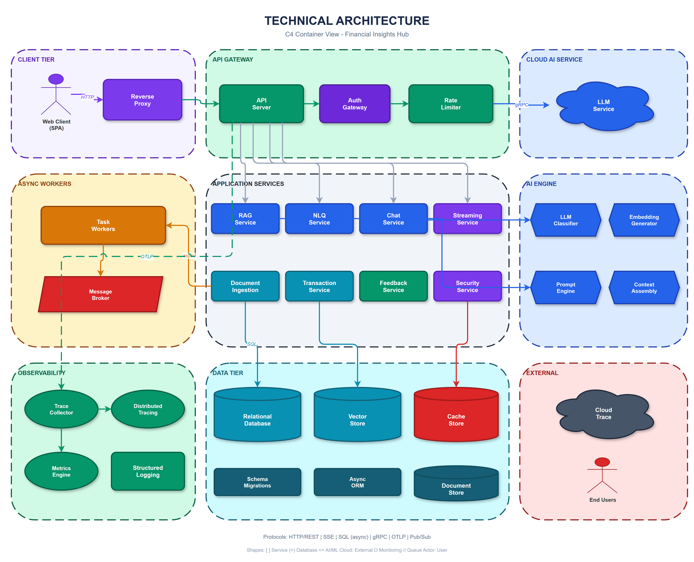
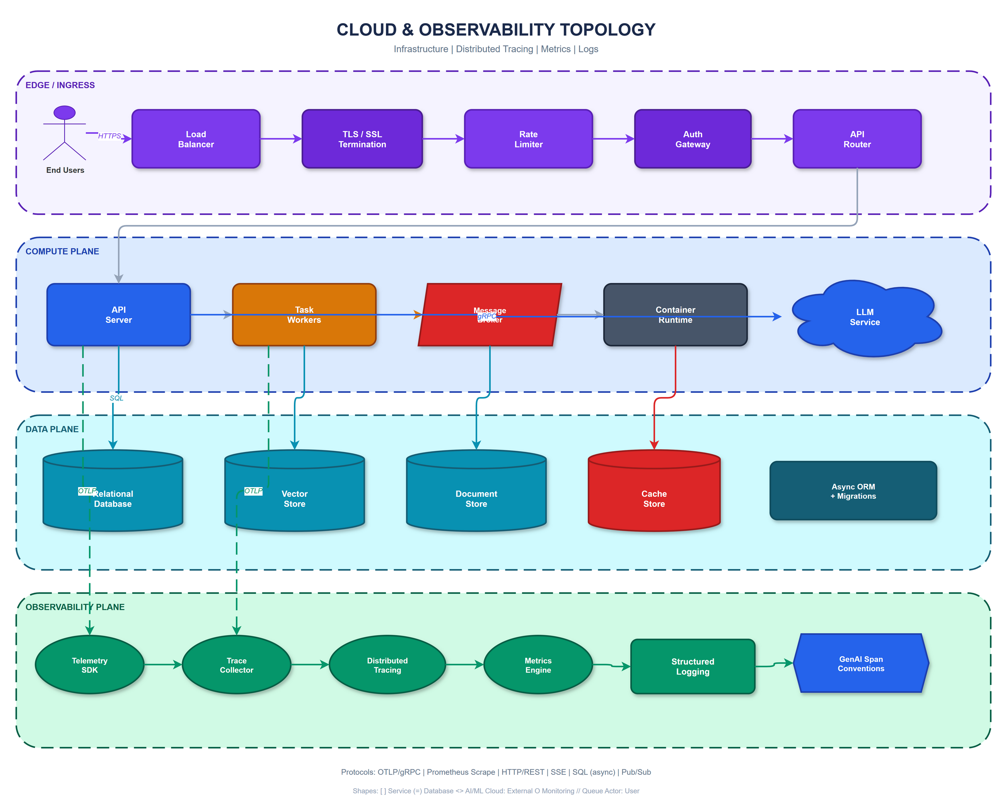

# Financial Insights Hub — Architecture Portfolio

> **AI-Powered Financial Analytics Platform**
> Python 3.12 · FastAPI · React 19 · Google Vertex AI (Gemini 2.5) · PostgreSQL 16 + pgvector · OpenTelemetry

---

## Overview

Financial Insights Hub is a production-grade platform that applies Generative AI to real-world personal financial analytics. It ingests financial documents (bank statements, credit card reports, investment summaries), extracts structured data using LLM pipelines, and provides intelligent querying through natural language, semantic search, and conversational AI.

This repository contains the **architecture documentation, design decisions, and representative code samples** from the project. The full implementation lives in a private repository with 50+ source modules, 20+ architecture specifications, and a comprehensive test suite.

**This is not a tutorial or proof-of-concept.** It is a working system with real document processing, real database schemas, and real observability infrastructure.

---

## System Architecture



### Cloud & Observability Architecture



### Architecture Layers

| Layer | Technology | Responsibility |
|-------|-----------|----------------|
| **Client** | React 19, TypeScript, TanStack Query, D3.js | SPA with SSE streaming, real-time dashboards |
| **Edge** | Nginx | Reverse proxy, TLS termination, rate limiting |
| **API** | FastAPI, Uvicorn (ASGI) | 12 RESTful route groups, middleware pipeline |
| **Services** | Python 3.12, Clean Architecture | Business logic orchestration, 20+ services |
| **Pipeline** | 6-step adaptive ingestion | Document classification → extraction → validation → embedding |
| **AI / LLM** | Google Vertex AI (Gemini 2.5 Flash & Pro) | Classification, extraction, RAG, NLQ, embeddings |
| **Data** | PostgreSQL 16 + pgvector, Redis 7 | Relational + vector store, distributed caching |
| **Observability** | OpenTelemetry, Jaeger, Prometheus, structlog | Distributed tracing with GenAI semantic conventions |

---

## Key Engineering Capabilities

### 1. Retrieval-Augmented Generation (RAG) Pipeline
Semantic search over financial data using pgvector (768-dimensional embeddings from `textembedding-gecko`), followed by Gemini-powered answer generation with citation tracking. The pipeline is orchestrated through a thin service layer that composes embedding, search, prompt construction, and generation without owning any persistence logic.

→ [Code Sample: RAG Service](samples/rag_service.py) · [Spec: LLM Extraction Contract](docs/specs/llm-extraction-contract.md)

### 2. Natural Language to SQL (NLQ) Engine
A 10-step pipeline that converts plain English questions into validated, safe SQL queries:

1. Input sanitization and topic guarding
2. Live schema context (categories, accounts from DB)
3. Entity resolution (ground ambiguous names to exact DB values)
4. Dynamic few-shot example retrieval from past successful queries
5. Prompt construction with schema + examples + question
6. Gemini Pro SQL generation
7. Response cleaning (strip markdown fences, fix syntax)
8. Multi-layer SQL safety validation (prevent injection, mutations)
9. Read-only execution with timeout and row limits
10. Self-healing: on SQL error, feeds error back to LLM for one retry attempt

The system improves with every interaction — successful queries are logged with embeddings and become future few-shot examples.

→ [Code Sample: NLQ Service](samples/nlq_service.py)

### 3. Adaptive Document Ingestion Pipeline
A 6-step pipeline that processes financial documents from raw upload to queryable structured data:

| Step | Component | What It Does |
|------|-----------|-------------|
| 1 | Text Extractor | PDF, image (OCR), CSV parsing |
| 2 | Gemini Classifier | Document type detection with confidence scoring |
| 3 | Gemini Extractor | Structured data extraction (parties, accounts, transactions) |
| 4 | Pydantic Validator | Schema enforcement, business rule validation |
| 5 | Embedding Generator | 768-dimensional vector generation for semantic search |
| 6 | Reconciliation | Deduplication, cross-document entity linking |

Each step follows the Strategy Pattern — the pipeline runner doesn't know which implementation is plugged in (mock vs. real Gemini). The "Two-Brain" pattern separates LLM reasoning (Brain 1) from Python validation (Brain 2).

→ [Code Sample: Gemini Classifier](samples/gemini_classifier.py) · [Spec: Adaptive Ingestion](docs/specs/adaptive-document-ingestion.md)

### 4. OpenTelemetry Distributed Tracing with GenAI Conventions
Enterprise-grade observability using OpenTelemetry SDK 1.40 with emerging GenAI semantic conventions (`gen_ai.*` attributes). Every LLM call is instrumented with:

- Model name, temperature, max tokens (request attributes)
- Input/output token counts, finish reason (response attributes)
- Latency histograms, error counters, token cost tracking
- Trace-correlated structured logging via structlog

The observability stack runs OTel Collector (contrib 0.114.0) exporting to Jaeger (traces) and Prometheus (metrics).

→ [Code Sample: OTel Span Helpers](samples/otel_spans.py) · [Spec: Infrastructure & Cross-Cutting](docs/specs/infrastructure-cross-cutting.md)

### 5. Real-Time Streaming (Server-Sent Events)
Token-by-token streaming for chat and RAG responses using SSE with:
- Backpressure handling at the FastAPI layer
- Structured event types (token, metadata, error, done)
- Auto-reconnect on the React client via EventSource API
- Graceful error recovery without breaking the stream

### 6. Clean Architecture with Enforcement
The codebase follows strict layered architecture: **Domain → Services → Adapters → API**. Dependency direction is enforced at build time using `import-linter` — a CI-breaking test catches any module importing upward across the boundary.

→ [Spec: Architecture & Patterns](docs/specs/architecture-and-patterns.md)

---

## Architecture Decision Records

| Decision | Summary | Rationale |
|----------|---------|-----------|
| [LangChain Assessment](docs/decisions/langchain-assessment.md) | **Do not adopt LangChain.** All 12 required capabilities already implemented with direct Vertex AI SDK. | Eliminates abstraction layer, reduces dependency surface, preserves full control over prompt construction. |
| [Extraction Model Selection](docs/decisions/extraction-model-decision.md) | **Gemini 2.5 Flash** for extraction with smart page filtering. | 8× cheaper than Pro at comparable accuracy. Page filtering reduces token cost by 40-60% on multi-page statements. |

---

## Technology Stack

| Category | Technologies |
|----------|-------------|
| **Runtime** | Python 3.12, Node.js 20 |
| **API** | FastAPI, Uvicorn, Pydantic v2 |
| **Frontend** | React 19, TypeScript, TanStack Query, Zustand, D3.js, Tailwind CSS |
| **AI / LLM** | Google Vertex AI (Gemini 2.5 Flash, Gemini 2.5 Pro), textembedding-gecko |
| **Database** | PostgreSQL 16 + pgvector (HNSW index), Alembic migrations |
| **Cache** | Redis 7 (distributed cache, session, rate limiting) |
| **ORM** | SQLAlchemy 2.0 (async), asyncpg |
| **Observability** | OpenTelemetry SDK 1.40, OTel Collector 0.114.0, Jaeger, Prometheus, structlog |
| **Infrastructure** | Docker Compose (8 services), Nginx, GCP-ready |
| **Quality** | pytest, import-linter, mypy, ruff |

---

## Repository Structure

```
financial-insights-architecture/
├── README.md
├── assets/
│   ├── architecture-diagram.png        # Technical architecture diagram
│   └── cloud-observability-diagram.png # Cloud & observability architecture
├── docs/
│   ├── specs/                          # Architecture specifications
│   │   ├── architecture-and-patterns.md
│   │   ├── infrastructure-cross-cutting.md
│   │   ├── database-schema.md
│   │   ├── llm-extraction-contract.md
│   │   ├── adaptive-document-ingestion.md
│   │   ├── document-upload-pipeline.md
│   │   ├── multi-tenant-security.md
│   │   └── feedback-loop-accuracy.md
│   └── decisions/                      # Architecture Decision Records
│       ├── langchain-assessment.md
│       └── extraction-model-decision.md
└── samples/                            # Representative code samples
    ├── rag_service.py
    ├── nlq_service.py
    ├── gemini_classifier.py
    ├── vertex_client.py
    └── otel_spans.py
```

---

## About the Author

**Ramakrishna (Ram) Bobba** — Software Engineer & Architect with 18 years of experience building enterprise systems across financial services, healthcare, insurance, and energy.

- IEEE Member (Senior Member application in progress)
- MBA — University of Illinois Urbana-Champaign, Gies College of Business
- MCA — Sikkim Manipal University
- B.Sc. — Osmania University (Mathematics, Physics, Computer Science)

[LinkedIn](https://linkedin.com/in/rbobba) · [GitHub](https://github.com/rbobba)

---

*Architecture documentation and code samples from the Financial Insights Hub platform. Full implementation is maintained in a private repository.*
